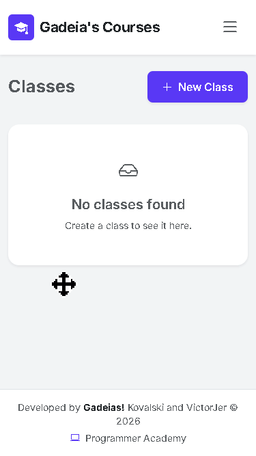
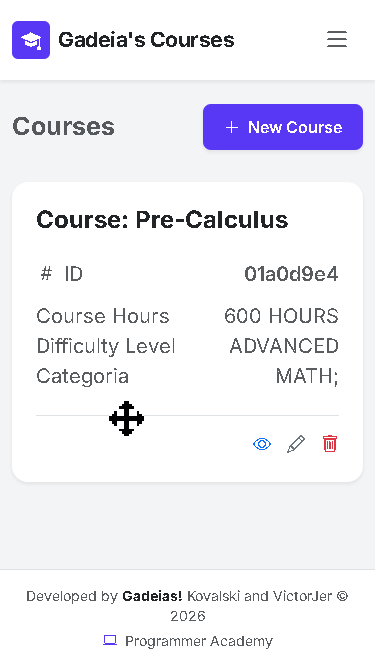

# Gadeia's Courses

Gadeia's Courses is a web application for managing an educational institution. It brings together student and tutor records, courses, lessons, class groups, categories, and student enrollments in one place.

## Technologies

- ASP.NET Core MVC on .NET 10
- Entity Framework Core with SQL Server
- ASP.NET Core Identity for authentication
- Bootstrap for the user interface
- AutoMapper for object mapping
- FluentResults for application operation results
- Serilog for logging

## Application Overview

	

## Courses and Classes

- **Courses:** Create and manage courses, including adding lessons to each course.
- **Classes:** Organize class groups and enroll students in them.

	

